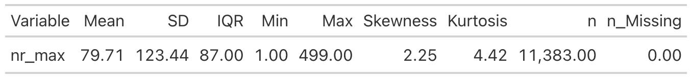

# Hintergrund


Dieser Arbeitsbericht schildert das technische Vorgehen im Rahmen der Analyse der Matomo-Daten des BMBF-Projekt "HaNS".

## Vorgehen

Die Matomo-Klickdaten aller Semester der Projektlaufzeit wurden für diese Analyse verarbeitet. Mit Hilfe einer R-Pipeline wurden eine Reihe von Forschungsfragen analysiert.

Der komplette Code ist online dokumentiert unter <https://github.com/sebastiansauer/hans>.
Aus Datenschutzgründen sind online keine Daten eingestellt.

Die zentrale Analyse-Pipeline-Datei ist <https://github.com/sebastiansauer/hans/blob/main/_targets.R>.


## Forschungsfragen


1. Wie viele Nutzer gibt es und in welchem Zeitraum?
2. In welcher Frequenz wird HaNS aufgesucht? Wie groß sind die zeitlichen Zwischenräume zwischen der Benutzung der Plattform?
3. Wie oft wird HaNS pro Zeitraum (z.B. Monat) besucht?
4. Wie verändert sich die Nutzung im Zeitverlauf?
5. Wie viele Aktionen bringt ein Visit mit sich? Wie ist die statistische Verteilung der Aktionen pro Visit?
6. Wie lang verweilen die Nutzer pro Visit?
7. Wie verändert sich die Nutzungsdauer pro Visit im Zeitverlauf?
8. Welche Aktionen führen die Nutzer auf Hans aus?
9. Wie verändern sich die Verteilungen der Aktionshäufigkeiten im Zeitverlauf?
10. An welchen Tagen und zu welcher Zeit kommen die User zu HaNS?
11. Wie häufig und in welcher Art inteagieren die Nutzer mit dem LLM in HaNS?
12. Wie groß ist der Anteil der Nutzer, die mit dem LLM interagieren?
13. Wie verändert sich der Anteil der Nutzer, die mit dem LLM interagieren, im Zeitverlauf?
14. Wie oft wird auf ein Wort im Transkript des LLM geklickt?
15. Wie oft wird ein Transkript-Dienst in HaNS in Anspruch genommen?
16. Wie verändert sich die Nutzung der Transkript-Dienste in HaNS im Zeitverlauf?
17. Wie lange werden Videos angeschaut?
18. Wie verändert sich die Betrachtungsdauer im Zeitverlauf?


# Setup

## R-Pakete starten


```{r load-libs}
library(targets)
library(tidyverse)
library(ggokabeito)
library(easystats)
library(gt)
library(ggfittext)
library(scales)
library(visdat)
library(collapse)
library(ggpubr)
library(knitr)
library(tinytable)
```

```{r}
#| cache: false
library(ggplot2)
theme_set(theme_minimal())
```


## Optionen setzen

```{r options}
options(lubridate.week.start = 1)  # Monday as first day
#options(collapse_mask = "all") # use collapse for all dplyr operations
options(chromote.headless = "new")  # Chrome headleass needed for gtsave
```


```{r}
scale_colour_discrete <- function(...) scale_colour_brewer(palette = "Set2")
scale_fill_discrete <- function(...) scale_fill_brewer(palette = "Set2")
```


<!-- Immer `knitr::kable` für das Zeigen von Data frames verwenden: -->


<!-- ```{r setup-kable, include=FALSE} -->
<!-- knitr::opts_chunk$set( -->
<!--   print.opts = list(use.kable = TRUE) -->
<!-- ) -->
<!-- ``` -->


## Daten laden

```{r import-tar-objects-data}
tar_load(ai_transcript_clicks_per_month)
tar_load(config)
tar_load(course_and_uni_per_visit)
tar_load(data_all_fct)
tar_load(data_long)
tar_load(data_prepped)
tar_load(data_separated_distinct_slice)
tar_load(data_separated_filtered)
#tar_load(data_users_only)
tar_load(idvisit_has_llm)
tar_load(llm_response_text)
tar_load(n_action)
tar_load(n_action_type)
tar_load(n_action_w_date)
tar_load(time_duration)
tar_load(time_since_last_visit)
tar_load(time_spent)
tar_load(time_spent_w_course_university)
tar_load(time_visit_wday)
```


# Datenaufbereitung und Analysepipeline


## Targets-Pipeline stellt Überblick aller Analyseschritte dar

Die Analyse wird im Rahmen einer [Targets-Pipeline](https://github.com/sebastiansauer/hans/blob/main/_targets.R) beschrieben und ist offen auf Github einsehbar. 


## Langformat

Aufgrund des "rechts flatternden" Datenformat (d.h. unterschiedliche Zeilenlängen) wurden die Daten in ein Langformat überführt, zwecks besserer/einfacherer Analyse.

Dazu wurden (neben den ID-Variablen, v.a. `idvisit`) die `actionDetails_`-Variablen verwendet.
Der Code des Pivotierens in das Langformat ist in der Funktion [longify-data.R](https://github.com/sebastiansauer/hans/blob/main/funs/longify-data.R) einsehbar.


Die Daten im Langformat wurden dann noch etwas aufbereitet mt der Funktion [slimify-data.R](https://github.com/sebastiansauer/hans/blob/main/funs/slimify_data.R).

```{r data_separated_filtered_head}
data_separated_filtered |> 
  head(30) 
```


# Überblick über die Daten

## Roh-Daten laden und inspizieren (data_all_fact)


### Dimension

Der Roh-Datensatz verfügt über

- `r nrow(data_all_fct)` Zeilen
- `r ncol(data_all_fct)` Spalten (Dubletten und Spalten mit Bildern bereits entfernt)

Jede Zeile entspricht einem "Visit".


### Erster Blick


```{r data_all_fct_head100}
data_all_fct_head100 <- 
data_all_fct %>% 
  select(1:100) %>% 
  slice_head(n = 100) 
```


```{r vis-dat}
data_all_fct_head100 %>% 
  visdat::vis_dat()
```

### (Fast) leere Spalten

```{r}
d_na_cols <- data.frame(
  id = 1:ncol(data_all_fct),
  names = names(data_all_fct),
  na_prop = colMeans(is.na(data_all_fct)))
```


#### Leere Spalten

```{r}
d_na_cols |> 
  filter(na_prop == 1)
```


#### Fast leere Spalten

```{r}
no_na_cols <- 
d_na_cols |>  
  filter(na_prop > .9) |> 
  nrow()

no_na_cols
```

:::{.callout-important}
Sehr viele Spalten, `r no_na_cols` sind fast leer.
:::


### Namen (1-100)


```{r data_all_fct_head100-2}
d_100_names <- data.frame(
  id = 1:100,
  col_name = data_all_fct_head100 %>% names())

d_100_names
```


### Werte der erst 100 Spalten


```{r}
data_all_fct_head100
```


### Datensatz data_separated_filtered, Zeilen 1-100

```{r data_separated_filtered}
data_separated_filtered %>% 
  slice(1:100)
```


## Fallzahl im Nur-User-Datensatz 

Entfernt man *Developer*, *Admins* und *Lecturers* aus dem Roh-Datensatz so bleiben weniger Zeilen übrig:


- `r nrow(data_prepped)` Zeilen
- `r ncol(data_prepped)` Spalten 


  

## Datensatz mit Anzahl der Aktionen pro User

```{r load-count-action}
n_action |> 
  head(30)
```


# Zeitraum


## Beginn/Ende der Daten


```{r time_minmax-load}
n_action_w_date |> 
  head(30)
```


```{r comp-time-min-max}
min_max_time <-
n_action_w_date |> 
  summarise(time_min = min(date_time_start, na.rm = T),
            time_max = max(date_time_start, na.rm = T)) 

min_max_time |> 
  gt()
```


:::{.callout-important}
Erster Visit im Datensatz: `r min_max_time$time_min`.

Letzter Visit im Datensatz: `r min_max_time$time_max`.
:::


Diese Statistik wurde auf Basis des Datenobjekts `data_separated_filtered` berechnet,
vgl. [das Target dieses Objekts in der Pipeline](https://github.com/sebastiansauer/hans/blob/main/_targets.R#L170).


## Days since last visit

### Insgesamt

```{r}
time_visit_wday |> 
  head(30) 
```


```{r days-since-last-visit}
time_since_last_visit <- 
time_since_last_visit |> 
  mutate(dayssincelastvisit = as.numeric(dayssincelastvisit)) 

time_since_last_visit |> 
  datawizard::describe_distribution(dayssincelastvisit) |> 
  knitr::kable(digits = 2)

time_since_last_visit |>
  ggplot(aes(x=dayssincelastvisit)) +
  geom_density() +
  labs(title = "If visitor return, they return mostly not later than a few days.")
```


:::{.callout-important}
Die Nutzer nutzen die Seite in Abständen von wenigen Tagen?
:::


### Nach Lehrveranstaltungen


```{r time_since_last_visit_per_course}
time_since_last_visit_per_course <- 
time_since_last_visit |> 
  left_join(course_and_uni_per_visit) |> 
  drop_na()
```


```{r time_since_last_visit_per_course_summary}
time_since_last_visit_per_course_summary <- 
time_since_last_visit_per_course |> 
  group_by(course) |> 
  summarise(dayssincelastvisit_mean = mean(dayssincelastvisit),
            dayssincelastvisit_sd = sd(dayssincelastvisit),
            dayssincelastvisit_n = n()) |> 
  mutate(dayssincelastvisit_n_log = log(dayssincelastvisit_n, base = 10) + 0.001)
```


```{r time_since_last_visit_per_course_summary-print}
time_since_last_visit_per_course_summary
```


```{r time_since_last_visit_per_course_summary-plot}
time_since_last_visit_per_course_summary |> 
  ggplot(aes(y = reorder(course, dayssincelastvisit_mean), 
             x = dayssincelastvisit_mean)) +
  geom_errorbar(aes(xmin = dayssincelastvisit_mean - dayssincelastvisit_sd,
                    xmax = dayssincelastvisit_mean + dayssincelastvisit_sd)) +
  geom_point(aes(alpha = log(dayssincelastvisit_n)),
             show.legend = FALSE) +
  labs(x = "Days since last visit (mean±sd)",
       y = "course",
       title = "In some courses, users use HaNS frequently.",
       caption = "Grey saturation of the mean dots refers to the log10 of the sample size (N)") +
  geom_text(aes(label = round(dayssincelastvisit_n)),
            x = Inf,
            hjust = 1.2,
            size = 2) +
  annotate(x = Inf, y = Inf, label = "N", geom = "label",
           hjust = 1,
           vjust = 1) +
  scale_y_discrete(expand = expansion(mult = 0.1)) +
  theme_minimal()
```


## Visits im Zeitverlauf

Wie viele Visits (von Hans) gab es?


### Pro Monat


```{r time_visit_wday_summary}
time_visit_wday_summary <- 
time_visit_wday |> 
  ungroup() |> 
  mutate(month_start = floor_date(date_time, "month")) |> 
  mutate(month_name = month(date_time, label = TRUE, abbr = FALSE),
         month_num = month(date_time, label = FALSE),
         year_num = year(date_time)) 
```


```{r time_visit_wday_summary-table}
time_visit_wday_summary |> 
  group_by(year_num, month_num) |> 
  summarise(n = n()) |> 
  gt()
```

```{r time_visit_wday_summary2-plot}
time_visit_wday_summary |> 
  group_by(year_num, month_start) |> 
  summarise(n = n()) |> 
  ggplot(aes(x = month_start, y = n)) +
  geom_line(group = 1, color = "grey60") +
  geom_point() +
  labs(title = "The number of visits reflect the teaching periods of the semesters.",
       x = "month/year")
```


### Pro Woche


```{r time_visit_wday_summary_week}
time_visit_wday_summary_week <- 
time_visit_wday |> 
  ungroup() |> 
  mutate(week_start = floor_date(date_time, "week")) |> 
  mutate(week_num = week(date_time),
         year_num = year(date_time))
```


```{r time_visit_wday_summary_week_summarized}
time_visit_wday_summary_week_summarized <-
time_visit_wday_summary_week   |> 
  group_by(year_num, week_num) |> 
  summarise(n = n())

time_visit_wday_summary_week_summarized
```


```{r time_visit_wday_summary_week_summarized_dateformat}
time_visit_wday_summary_week_summarized_dateformat <-
time_visit_wday_summary_week   |> 
  group_by(week_start) |> 
  summarise(n = n())
```


```{r time_visit_wday_summary_week_summarized_dateformat-plot}
time_visit_wday_summary_week_summarized_dateformat |> 
  ggplot(aes(x = week_start, y = n)) +
  geom_line(group = 1, color = "grey60") +
  geom_point() +
  geom_smooth(method = "gam", se = FALSE, color = "blue") +
  labs(title = "The number of visits is increasing and reflects the teaching periods of the semesters.",
       x = "week number/year")
```


:::{.callout-important}
The number of visits has increased over time.
:::


### Akkumulierte Seitenaufrufe im Zeitverlauf

#### Monat


```{r time_visit_wday_summary-plot}
time_visit_wday_summary |> 
  group_by(year_num, month_start) |> 
  summarise(n = n()) |> 
  ungroup() |> 
  mutate(n_cumsum = cumsum(n)) |> 
  ggplot(aes(x = month_start, y = n_cumsum)) +
  geom_line(group = 1, color = "grey60") +
  geom_point() +
  theme_minimal() +
  geom_smooth(method = "lm") +
  labs(title = "Visits have increased linearly over time.",
       x = "month/year")
```


#### Woche


```{r}
time_visit_wday_summary_week |> 
  group_by(year_num, week_start) |> 
  summarise(n = n()) |> 
  ungroup() |> 
  mutate(n_cumsum = cumsum(n)) |> 
  ggplot(aes(x = week_start, y = n_cumsum)) +
  geom_line(group = 1, color = "grey60") +
  geom_point() +
  theme_minimal() +
  geom_smooth(method = "lm") +
  labs(title = "Visits have increased approx. linearly over time.",
       x = "week/year")
```


## Statistiken

Die folgenden Statistiken beruhen auf dem Datensatz `data_separated_filtered`:


```{r}
glimpse(data_separated_filtered)
```

`nr` fasst die Nummer der Aktion innerhalb eines bestimmten Visits.


## Mit allen Daten (den 499er-Daten)


```{r tbl_n_action}
tbl_n_action <- 
n_action |> 
  describe_distribution(nr_max, centrality = c("median", "mean")) 

tbl_n_action
```





`nr_max` gibt den Maximalwert von `nr` zurück, sagt also, wie viele Aktionen maximal während eines Vitis ausgeführt wurden.

Betrachtet man die Anzahl der Aktionen pro Visit näher, so fällt auf, dass der Maximalwert (499) sehr häufig vorkommt:

```{r count-action-plot}
n_action |> 
  count(nr_max) |> 
  ggplot(aes(x = nr_max, y = n)) +
  geom_col() +
  geom_vline(xintercept = tbl_n_action$Median, color = "blue", linetype = "dashed") +
  labs(caption = "Vertical dashed lines shows the median.",
       title = "Most users to only a few actions, but some do many.")

```


:::{.callout-important}
Die meisten Nutzer machen nur wenige Aktionen pro Visit,
aber einige machen sehr viele.
:::

Hier noch in einer anderen Darstellung:

```{r count-action-plot2}
n_action |> 
  count(nr_max) |> 
  ggplot(aes(x = nr_max, y = n)) +
  geom_point()
```

Der Maximalwert ist einfach auffällig häufig:


```{r n-action-table}
n_action |> 
  count(nr_max == 499) |> 
  gt()
```


Es erscheint plausibel, dass der Maximalwert alle "gekappten" (*zensierten*, abgeschnittenen) Werte fasst, 
also viele Werte, die eigentlich größer wären (aber dann zensiert wurden).

## Nur Visitors, für die weniger als 500 Aktionen protokolliert sind


```{r count-action-tbl2}
n_action_lt_500 <- 
n_action |> 
  filter(nr_max != 499) 

n_action_lt_500 |> 
  describe_distribution(nr_max) |> 
  gt() |> 
  fmt_number(columns = where(is.numeric),
             decimals = 2)
```


# Lehrveranstaltungen


## Anzahl an Lehrveranstaltungen nach Hochschule

```{r course_and_uni_per_visit-count}
course_and_uni_per_visit |> 
count(university)
```

```{r course_and_uni_per_visit_plot}
course_and_uni_per_visit |> 
count(university) |> 
ggplot(aes(y = reorder(university, n), x = n)) +
geom_col() +
theme_minimal() +
  labs(title = "TH Nürnberg hosts the most courses on HaNS by far.",
       y = "University")
```

## Visits nach Lehrveranstaltung und Jahr


```{r time_spent_w_course_university_count}
time_spent_w_course_university |> 
count(year, course)
```

```{r}
time_spent_w_course_university |> 
count(year, course) |> 
drop_na() |> 
ggplot(aes(x = n, y = course, fill = factor(year),)) +
geom_col(position = "dodge") +
  labs(title = "The course 'GeSOA' is the most active course on HaNS.")
```


# Aktionen pro Visit

## Statistiken pro Visit


```{r data_prepped}
n_actions_searches_interactions <- 
  data_prepped |> 
  select(idvisit, fingerprint, searches, actions, interactions, referrertype, referrername, language, devicetype, devicemodel, operatingsystem, browsername) 

```

### Unique IDs, Fingerprints, Mean searches, Mean actions

Auswertung 
- der Anzahlen der uniquen visitids und uniquen Fingerprints
- Mittelwerte der Anzahl der Suchen und Aktionen pro Besuch


```{r n_actions_searches_interactions-summary}
n_actions_searches_interactions |> 
  as.data.frame() |> 
  summarise(idvisit_n = length(unique(idvisit)),
fingerprint_n = length(unique(fingerprint)),
actions_mean = mean(as.integer(actions), na.rm = TRUE),
searches_mean = mean(as.integer(searches), na.rm = TRUE))
```


:::{.callout-note}
Es gibt etwa doppelt so viele Besucher wie unique Nutzer.
:::


### Referrer Type pro Visit

```{r}
n_actions_searches_interactions |> 
count(referrertype, sort = TRUE)
```


### Referrer Type Name pro Visit

```{r}
n_actions_searches_interactions |> 
count(referrername, sort = TRUE)
```

### devicemodel


 
```{r}
n_actions_searches_interactions |> 
count(devicemodel, sort = TRUE) |> 
slice_head(n = 10)
```

### operatingsystem

```{r}
n_actions_searches_interactions |> 
count(operatingsystem, sort = TRUE) |> 
slice_head(n = 10)
```

### browsername


```{r}
n_actions_searches_interactions |> 
count(browsername, sort = TRUE) |> 
slice_head(n = 10)
```


Die Mac-User scheinen besonders aktiv zu sein auf HaNS.

## Mit den 499er-Daten

```{r plot-count-action}
n_action_avg = mean(n_action$nr_max) |> round(0)
n_action_median = median(n_action$nr_max) |> round(0)
n_action_sd = sd(n_action$nr_max) |> round(0)
n_action_iqr = IQR(n_action$nr_max) |> round(0)

n_action |> 
  ggplot() +
  geom_histogram(aes(x = nr_max)) +
  labs(x = "Anzahl von Aktionen pro Visit",
       y = "n",
       caption = "Der vertikale Strich zeigt den Mittelwert; der horizontale MW±SD") +
  theme_minimal() +
  geom_vline(xintercept = n_action_avg,
             color = palette_okabe_ito()[1]) +
  geom_segment(x = n_action_avg - n_action_sd,
               y = 0,
               xend = n_action_avg + n_action_sd,
               yend = 0,
               color = palette_okabe_ito()[2],
               size = 2) +
  annotate("label", x = n_action_avg, y = 1500, 
           label = paste0("MW = ", n_action_avg)) +
  annotate("label", 
           x = n_action_avg + n_action_sd, 
           y = 0, 
           label = paste0("SD = ", n_action_sd))
  #geom_label(aes(x = n_action_avg), y = 1, label = "Mean")


n_action |> 
  ggplot() +
  geom_histogram(aes(x = nr_max)) +
  labs(x = "Anzahl von Aktionen pro Visit",
       y = "n",
       caption = "Der vertikale Strich zeigt den Median; der horizontale Median±IQR") +
  theme_minimal() +
  geom_vline(xintercept = n_action_median,
             color = palette_okabe_ito()[1]) +
  geom_segment(x = n_action_median - n_action_iqr,
               y = 0,
               xend = n_action_median + n_action_iqr,
               yend = 0,
               color = palette_okabe_ito()[2],
               size = 2) +
  annotate("label", x = n_action_median, y = 1500, 
           label = paste0("Md = ", n_action_median)) +
  annotate("label", 
           x = n_action_median + n_action_iqr, 
           y = 0, 
           label = paste0("IQR = ", n_action_iqr))
  #geom_label(aes(x = n_action_avg), y = 1, label = "Mean")
```


- Mittelwert der Aktionen pro Visit: `r round(n_action_avg, 2)`.
- SD der Aktionen pro Visit: `r round(n_action_sd, 2)`.
- MD:  `r round(n_action_median, 2)`.
- IQR: : `r round(n_action_iqr, 2)`. 


## Ohne 499er-Daten

```{r plot-count-action-2}
n_action_avg2 = mean(n_action_lt_500$nr_max) |> round(0)
n_action_sd2 = sd(n_action_lt_500$nr_max) |> round(2)

n_action_lt_500 |> 
  ggplot() +
  geom_histogram(aes(x = nr_max)) +
  labs(x = "Anzahl von Aktionen pro Visit",
       y = "n",
       title = "Verteilung der User-Aktionen pro Visit",
       caption = "Der vertikale Strich zeigt den Mittelwert; der horizontale die SD") +
  theme_minimal() +
  geom_vline(xintercept = n_action_avg2,
             color = palette_okabe_ito()[1]) +
  geom_segment(x = n_action_avg - n_action_sd2,
               y = 0,
               xend = n_action_avg2 + n_action_sd2,
               yend = 0,
               color = palette_okabe_ito()[2],
               size = 2) +
  annotate("label", x = n_action_avg2, y = 1500, 
           label = paste0("MW = ", n_action_avg2)) +
  annotate("label", 
           x = n_action_avg2 + n_action_sd2, 
           y = 0, 
           label = paste0("SD = ", n_action_sd2))
  #geom_label(aes(x = n_action_avg), y = 1, label = "Mean")
```


- Mittelwert der Aktionen pro Visit: `r round(n_action_avg2, 2)`.
- SD der Aktionen pro Visit: `r round(n_action_sd2, 2)`.


## Anzahl Aktionen im Zeitverlauf

### Monat


```{r}
n_action_w_date |> 
  ggplot(aes(x = month_date, y = nr_max)) +
stat_summary(fun = mean, geom = "point", size = 2) +
stat_summary(fun.data = mean_sdl, fun.args = list(mult = 1), geom = "errorbar", width = 0.2) +
  geom_smooth(method = "lm") +
  labs(title = "The number of actions per visit has incresed over time")
```


```{r n_action_w_date-plot}
n_action_w_date |> 
  ggplot(aes(x = month_date, y = nr_max)) +
geom_jitter(alpha = .1) 
```


### Regression (Monat)

```{r}
lm(nr_max ~ month_date, data = n_action_w_date)
```

### Woche

```{r}
n_action_w_date |> 
  mutate(week_date = as.Date(week_date)) |> 
  ggplot(aes(x = week_date, y = nr_max)) +
stat_summary(fun = mean, geom = "point", size = 2) +
stat_summary(fun.data = mean_sdl, geom = "errorbar", width = 0.2) +
  geom_smooth(method = "lm") +
  labs(title = "The number of actions per visit has incresed over time")
```

### Regression (Woche)

```{r}
lm(nr_max ~ week_date, data = n_action_w_date)
```


## Gruppierung der Visits nach Anzahl der Aktionen


```{r}
n_action_lt_500 <- 
n_action_lt_500 |> 
 mutate(n_actions_type =
   case_when(nr_max < 30 ~ "glimpser",
             nr_max < 300 ~ "serious user",
             TRUE ~ "heavy user"))
```

```{r}
n_action_lt_500 |> 
  count(n_actions_type) |> 
  gt()
```

```{r}
ggplot(n_action_lt_500) +
aes(x = n_actions_type) +
geom_bar()
```


## Gruppierung der Visits im Zeitverlauf


```{r}
n_action_w_date |> 
group_by(month_date) |> 
count(nr_max)  |> 
mutate(n_actions_type =
case_when(nr_max < 30 ~ "glimpser",
nr_max < 300 ~ "serious user",
TRUE ~ "heavy user"))  |> 
count(n_actions_type) |> 
ggplot(aes(x = month_date, y = n, 
color = n_actions_type, group = n_actions_type)) +
geom_point() +
geom_line()
```


# Verweildauer pro Visit 

## Berechnungsgrundlage der Verweildauer

Die Verweildauer wurde berechnet als Differenz zwischen kleinstem und größtem Datumszeitwert (POSixct) eines Visits (also pro Wert der Variablen `idvisit`), vgl. [Funktion `diff_time](https://github.com/sebastiansauer/hans/blob/main/funs/diff_time.R).
Diese Variable heißt `time_diff` im Objekt `time_spent`.

Dabei wird das Objekt `data_separated_filtered` herangezogen, vgl. [die Definition es Targets "time_spent" in der Targets-Pipeline](https://github.com/sebastiansauer/hans/blob/main/_targets.R#L205).


## Vorverarbeitung

Die Visit-Zeit wurde auf 600 Min. trunkiert/begrenzt.


```{r}
time_spent |> 
  head(30) 
```


```{r load-time-spent}
time_spent <- 
  time_spent |> 
  # compute time (t) in minutes (min):
  mutate(t_minutes = as.numeric(time_diff, units = "mins")) |> 
  filter(t_minutes < 600)
```

## Verweildauer-Statistiken in Sekunden 

Die Verweildauer ist im Folgenden dargestellt auf Grundlage oben dargestellter Berechnungsgrundlage (in Sekunden).


```{r comp-diff-time-stats}
time_spent |> 
  summarise(
    mean_time_diff = round(mean(time_diff), 2),
    sd_time_diff = sd(time_diff),
    min_time_diff = min(time_diff),  # shortest duration
    max_time_diff = max(time_diff)  # longest
  )
```


## Verweildauer auf Basis der Variable `visitduration`

Alternativ zur Berechnung der Verweildauer steht eine Variable, `visitduration` zur Verfügung, die (offenbar) die Dauer des Visits misst bzw. messen soll.

Allerdings resultieren substanziell andere Werte,
wenn man diese Variable heranzieht zur Berechnung der Verweildauer,
vgl. [Target `time_duration` in der Targets-Pipeline](https://github.com/sebastiansauer/hans/blob/main/_targets.R#L211).


```{r}
time_duration |> 
  head(30)
```


```{r time-duration}
time_duration |> 
  summarise(duration_sec_avg = mean(visitduration_sec, na.rm = TRUE))  |> 
  mutate(duration_min_avg = duration_sec_avg / 60)
```


## Verweildauer-Statistiken in Minuten

```{r time-spent-tbl}

time_spent |> 
  mutate(time_diff_minutes = time_length(time_diff, unit = "minute")) |> 
  summarise(
    mean_time_diff = round(mean(time_diff_minutes), 2),
    sd_time_diff = sd(time_diff_minutes),
    min_time_diff = min(time_diff_minutes),  # shortest duration
    max_time_diff = max(time_diff_minutes)  # longest
  ) 
```


```{r}
small_padding_theme <- ggpubr::ttheme(
  tbody.style = tbody_style(size = 8), # Smaller font size can help
  colnames.style = colnames_style(size = 9, face = "bold"),
  padding = unit(c(2, 2), "mm") # Reduce horizontal and vertical padding
)
```


```{r}
#| eval: false
ggpubr::ggtexttable(time_spent_summary,
                    rows = NULL,
                    theme = small_padding_theme)
```


## Visualisierung der Verweildauer

### Binwidth=10 Minutes

```{r plot-time-spent1}
time_spent |> 
  mutate(time_diff_minutes = time_diff/60) |> 
  ggplot(aes(x = time_diff_minutes)) +  # minutes
  geom_histogram(binwidth=10) +
  #scale_x_time() +
  theme_minimal() +
  labs(y = "n",
       x = "Verweildauer in HaNS pro Visit in d:h:m") +
  scale_x_time(breaks = pretty_breaks())
```


### Bin width= 20 Minutes

```{r plot-time-spent2}
time_spent |> 
 mutate(time_diff_minutes = time_diff/60) |> 
  ggplot(aes(x = time_diff_minutes)) +  # minutes
  geom_histogram(binwidth = 20) +
  theme_minimal() +
  labs(y = "n",
       x = "Verweildauer",
       title = "Verweildauer in HaNS pro Visit in d:h:m") +
  scale_x_time(breaks = pretty_breaks())
```

### Zeitdauer begrenzt auf 1-120 Min.

```{r plot-time-spent3}
time_spent2 <- 
time_spent |> 
  filter(time_diff > 1, time_diff < 120) 

time_spent2 |> 
  ggplot(aes(x = time_diff)) +
  geom_histogram(binwidth = 10) +
  theme_minimal() +
  labs(y = "n",
       x = "Verweildauer in HaNS pro Visit in Minuten",
       title = "Verweildauer begrenzt auf 1-120 Minuten",
       caption = "bindwidth = 10 Min.")
```


### Veränderung der Verweildauer im Zeitverlauf

#### Monat

Die Einheit von `time_spent` ist Sekunden.

```{r}
time_spent_by_month <-
  time_spent |> 
  mutate(month_start = floor_date(time_min, "month")) |> 
  mutate(month_name = month(month_start, label = TRUE, abbr = FALSE),
         month_num = month(month_start, label = FALSE),
         year = year(month_start)) |> 
  group_by(month_num, year) |> 
  summarise(time_spent_month_avg = mean(time_diff, na.rm = TRUE),
            time_spent_month_sd = sd(time_diff, na.rm = TRUE)) |> 
  arrange(year, month_num)

time_spent_by_month 
```


```{r time_spent_by_month}
time_spent_by_month |> 
  mutate(time_spent_month_avg = round(time_spent_month_avg, 2),
         time_spent_month_sd = round(time_spent_month_sd, 2)) |> 
  ggtexttable()
```


```{r time_spent_by_month_name}
time_spent_by_month_name <- 
time_spent |> 
  mutate(month_start = floor_date(time_min, "month")) |> 
  mutate(month_name = month(month_start, label = TRUE, abbr = FALSE),
         month_num = month(month_start, label = FALSE),
         year = year(month_start)) |> 
  group_by(month_start, year) |> 
  summarise(time_spent_month_avg = mean(time_diff, na.rm = TRUE),
            time_spent_month_sd = sd(time_diff, na.rm = TRUE))

time_spent_by_month_name |> 
ggplot(aes(x = month_start, y = time_spent_month_avg)) +
  geom_line(group = 1, color = "grey60") +
    geom_point() 
```


#### Jahr

```{r}
time_spent_by_year <- 
time_spent |> 
  mutate(month_start = floor_date(time_min, "month")) |> 
  mutate(month_name = month(month_start, label = TRUE, abbr = FALSE),
         month_num = month(month_start, label = FALSE),
         year = year(month_start)) |> 
  group_by(year) |> 
  summarise(time_spent_avg = mean(time_diff, na.rm = TRUE),
            time_spent_sd = sd(time_diff, na.rm = TRUE))

time_spent_by_year
```


```{r}
time_spent_by_year |> 
  ggplot(aes(x = year, y = time_spent_avg)) +
  geom_line(group = 1, color = "grey60") +
    geom_point() 
```


#### Woche


```{r time_spent_by_week_name}

time_spent_by_week_name <- 
time_spent |> 
  mutate(week_start = floor_date(time_min, "week")) |> 
  mutate(week_num = week(week_start),
         year = year(week_start)) |> 
  group_by(week_start, year) |> 
  summarise(time_spent_week_avg = mean(time_diff, na.rm = TRUE),
            time_spent_week_sd = sd(time_diff, na.rm = TRUE))

time_spent_by_week_name |> 
ggplot(aes(x = week_start, y = time_spent_week_avg)) +
  geom_line(group = 1, color = "grey60") +
    geom_point() 
```


## Zusammenhang von Lehrveranstaltung und Verweildauer


```{r}
time_spent_w_course_university_summary <- 
time_spent_w_course_university |> 
group_by(floor_date_month) |> 
summarise(distinct_courses_n = n_distinct(course),
diff_time_mean = mean(time_diff, na.rm = TRUE),
n = n())

time_spent_w_course_university_summary
```


```{r}
time_spent_w_course_university_summary |> 
ggplot(aes(x = distinct_courses_n, y = diff_time_mean)) +
geom_point()
```

## Zusammenhang von Lehrveranstaltung und Anzahl Visits

```{r}
time_spent_w_course_university_summary |> 
ggplot(aes(x = distinct_courses_n, y = n)) +
geom_point() +
labs(y = "No. of visits per month",
x = "No. of distinct courses per month")
```

# Was machen die User?


Was machen die Visitors eigentlich? Und wie oft?

## Häufigkeiten

 


Für das Objekt `n_action_type` wurde die Spalte `subtitle` in den Langformat-Daten ausgewertet, s. [Funktionsdefinition von `count_user_action_type`](https://github.com/sebastiansauer/hans/blob/main/funs/count_user_action.R).


```{r}
n_action_type |> 
  head(30) 
```


Achtung: Es kann sinnvoller sein,
alternativ zu dieser Analyse
die Analyse auf Basis von `eventcategory` heranzuziehen.
Dort werden alle Arten von Events berücksichtigt. 
Hier, in der vorliegenden, nur ausgewählte Events.


### Nach bestimmten Kategorien

```{r category-tab}
n_action_type_counted <- 
n_action_type |> 
  drop_na() |> 
  count(category, sort = TRUE) |> 
  mutate(prop = round(n/sum(n), 2)) 

n_action_type_counted |> 
  gt()
```


### Nach Kategorien im Zeitverlauf

```{r}
n_action_type_per_month <- 
n_action_type |> 
  select(nr, idvisit, category) |> 
  ungroup() |> 
  left_join(time_visit_wday |> ungroup()) |> 
  select(-c(dow, hour, nr)) |> 
  drop_na() |> 
  mutate(month_start = floor_date(date_time, "month")) |> 
  count(month_start, category)
```

```{r}
n_action_type_per_month 
```

### Nur die Top3-Kategorien


```{r}
time_visit_wday |> 
  head(30)
```


```{r n_action_type_per_month_top3}
n_action_type_per_month_top3 <- 
n_action_type |> 
  select(nr, idvisit, category) |> 
  ungroup() |> 
  filter(category %in% c("video", "click_slideChange", "visit_page")) |> 
  left_join(time_visit_wday |> ungroup()) |> 
  select(-c(dow, hour, nr)) |> 
  drop_na() |> 
  mutate(month_start = floor_date(date_time, "month")) |> 
  count(month_start, category)
```

```{r n_action_type_per_month_top3-gt}
n_action_type_per_month_top3 
```


```{r n_action_type_per_month_top3-ggplot}
n_action_type_per_month_top3 |> 
  ggplot(aes(x = month_start, y = n, color = category, group = category)) +
  geom_line()
```

### Top3 - Pro Kurs


```{r n_action_type_course_uni} 
n_action_type_course_uni <-
n_action_type |> 
  left_join(course_and_uni_per_visit |> mutate(idvisit = as.integer(idvisit)))
```

```{r n_action_type_per_month_top3_per_course}
n_action_type_per_month_top3_per_course <- 
n_action_type_course_uni |> 
  filter(category %in% c("video", "click_slideChange", "visit_page")) |> 
  drop_na() |> 
  mutate(month_start = floor_date(actiondetails_0_timestamp, "month")) |> 
  count(course, month_start, category)
```

```{r n_action_type_per_month_top3_per_course-plot}
n_action_type_per_month_top3_per_course |> 
  ggplot(aes(x = month_start, y = n, color = category, group = category)) +
  facet_wrap(~ course) +
  geom_line()
```


### `eventcategory`

Für folgende Analyse wurde eine andere Variable als oben herangezogen, nämlich `eventcategory`. Dadurch resultieren etwas andere Ergebnisse.


```{r data_separated_filtered_count}
data_separated_filtered_count <- 
data_separated_filtered |> 
  filter(type == "eventcategory") |> 
  count(value, sort = TRUE) |> 
  mutate(prop = n / sum(n))

data_separated_filtered_count 
```

```{r}
data_separated_filtered_count |> 
  ggtexttable()
```

Als Excel-Datei abspeichern:

```{r}
#data_separated_filtered_count |> 
#  writexl::write_xlsx(path = "obj/data_separated_filtered_count.xlsx")
```


### User-Typen nach Aktivitäten

Was ist die Hauptaktivität pro User? - Verteilung


```{r}
n_action_type_distro <-  
n_action_type |> 
group_by(idvisit) |> 
summarise(category_max = max(category, na.rm = TRUE)) |> 
count(category_max)

n_action_type_distro
```


```{r}
n_action_type_distro |> 
ggplot(aes(x = n, y = category_max)) +
geom_col()
```


## Verteilung

```{r}
n_action_type_counted <- 
n_action_type |> 
  count(category, sort = TRUE) 
```


### Insgesamt - Rohwerte

```{r vis-count-action-type}
n_action_type_counted |> 
  ggplot(aes(y = reorder(category, n), x = n)) +
  geom_col() +
  geom_bar_text() +
  labs(
    x = "User-Aktion",
    y = "Aktion",
    title = "Anzahl der User-Aktionen nach Kategorie"
  ) +
  theme_minimal() +
  scale_x_continuous(labels = scales::comma)
```


### Insgesamt - Log-Skalierung

```{r vis-count-action-type-log}
#| fig-width: 9
n_action_type_counted |> 
  ggplot(aes(y = reorder(category, n), x = n)) +
  geom_col() +
  geom_bar_text() +
  labs(
    x = "Anazhl der User-Aktionen",
    y = "Aktion",
    title = "Anzahl der User-Aktionen nach Kategorie",
    caption = "Log10-Skala"
  ) +
  theme_minimal() +
  scale_x_log10()
```


### Pro Kurs - Rohwerte


```{r n_action_type_course_uni_counted}
n_action_type_course_uni_counted <- 
n_action_type_course_uni |> 
  group_by(course) |> 
  count(category, sort = TRUE) |> 
  drop_na()
```


```{r n_action_type_course_uni_counted_plot}
#| fig-asp: 1.5
n_action_type_course_uni_counted |> 
  ggplot() +
  aes(y = category, x = log(n, base = 10)) +
  geom_col() +
  facet_wrap(~course)
```


# An welchen Tagen und zu welcher Zeit kommen die User zu HaNS?

## Setup


```{r setup-dates}
# Define a vector with the names of the days of the week
# Note: Adjust the start of the week (Sunday or Monday) as per your requirement
days_of_week <- c("Monday", "Tuesday", "Wednesday", "Thursday", "Friday", "Saturday", "Sunday")

# Replace numbers with day names
time_visit_wday$dow2 <- factor(days_of_week[time_visit_wday$dow],
                               levels = days_of_week)
```


## HaNS-Login nach Uhrzeit

```{r vis-hans-login-hour}
time_visit_wday |> 
  as_tibble() |> 
  count(hour) |> 
  mutate(prop = n/sum(n)) |> 
  ggplot(aes(x = hour, y = prop)) +
  geom_col() +
  theme_minimal() +
  labs(
    title = "HaNS-Nutzer sind keine Frühaufsteher",
    x = "Uhrzeit",
    y = "Anteil"
  )
 # coord_polar()
```


```{r vis-hans-login-hour-polar}
time_visit_wday |> 
  as_tibble() |> 
  count(hour) |> 
  mutate(prop = n/sum(n)) |> 
  ggplot(aes(x = hour, y = prop)) +
  geom_col() +
  theme_minimal() +
  coord_polar()
```


## Verteilung der HaNS-Besuche nach Wochentagen


```{r vis-hans-login-wday-bar}
time_visit_wday |> 
  as_tibble() |> 
  count(dow2) |> 
  mutate(prop = n/sum(n)) |> 
  ggplot(aes(x = dow2, y = prop)) +
  geom_col() +
  theme_minimal() +
  labs(title = "Verteilung der HaNS-Logins nach Wochentagen",
       x = "Wochentag",
       y = "Anteil")
 # coord_polar()
```


```{r vis-hans-login-wday-polar}
time_visit_wday |> 
  as_tibble() |> 
  count(dow2) |> 
  mutate(prop = n/sum(n)) |> 
  ggplot(aes(x = dow2, y = prop)) +
  geom_col() +
  theme_minimal() +
  labs(title = "Verteilung der HaNS-Logins nach Wochentagen",
       x = "Wochentag",
       y = "Anteil")  +
  coord_polar()
```


### HaNS-Login nach Wochentagen Uhrzeit


```{r vis-hans-login-wday-hour}
time_visit_wday |> 
  as_tibble() |> 
  count(dow2, hour) |> 
  group_by(dow2) |> 
  mutate(prop = n/sum(n)) |> 
  ggplot(aes(x = hour, y = prop)) +
  geom_col() +
  facet_wrap(~ dow2) +
  theme_minimal() +
  labs(title = "Verteilung der HaNS-Logins nach Wochentagen und Uhrzeiten",
       x = "Wochentag",
       y = "Anteil")
 # coord_polar()
```


```{r vis-hans-login-wday-hour-polar}
#| fig-width: 9
#| fig-asp: 1.5
time_visit_wday |> 
  as_tibble() |> 
  count(dow2, hour) |> 
  group_by(dow2) |> 
  mutate(prop = n/sum(n)) |> 
  ggplot(aes(x = hour, y = prop)) +
  geom_col() +
  facet_wrap(~ dow2) +
  theme_minimal() +
  labs(title = "Verteilung der HaNS-Logins nach Wochentagen und Uhrzeiten",
       x = "Wochentag",
       y = "Anteil") +
  coord_polar()
```

## Anzahl der Visits nach Datum (Tagen) und Uhrzeit (bin2d)

```{r}
time2 <- 
time_visit_wday |> 
  ungroup() |> 
  mutate(date = as.Date(date_time)) |> 
  mutate(month_start = floor_date(date_time, "month")) 

time2 |> 
  ggplot(aes(x = date, y = hour)) +
  geom_bin2d(binwidth = c(1, 1)) + # (1 day, 1 hour)
  scale_x_date(date_breaks = "1 month") +
  theme(legend.position = "bottom") +
  scale_fill_viridis_c() +
  labs(caption = "Each x-bin maps to one week") +
  scale_x_date(breaks = breaks_pretty())
 
```


## Anzahl der Visits nach Datum (Wochen) und Uhrzeit (bin2d)


```{r}
time2 |> 
  ggplot(aes(x = date, y = hour)) +
  geom_bin2d(binwidth = c(7, 1)) +  # 1 week, 1 hour
  scale_x_date(date_breaks = "1 week", date_labels = "%W") +
  theme(legend.position = "bottom") +
  scale_fill_viridis_c()  +
  labs(x = "Week number in 2023/2024", 
       caption = "Each x-bin maps to one week") +
  scale_x_date(breaks = breaks_pretty())
```

## Anzahl der Visits nach Datum (Wochen) und Wochentag (bin2d)


```{r p-visits-day-wday}
time2 |> 
  ggplot(aes(x = date, y = dow)) +
  geom_bin2d(binwidth = c(7, 1)) +  # 1 week, 1 hour
  scale_x_date(date_breaks = "1 week", date_labels = "%W") +
  theme(legend.position = "bottom") +
  scale_fill_viridis_c()  +
  labs(x = "Week number in 2023/2024",
       caption = "Each x-bin maps to one week",
       y = "Day of Week") +
  scale_y_continuous(breaks = 1:7)   +
  scale_x_date(breaks = breaks_pretty())

```


# KI-Gebrauch


## Interaktion mit dem LLM

Berechnungsgrundlage: Für diese Analyse wurden alle Events der Kategorie `llm` gefiltert.

### Art und Anzahl der Interaktionen mit dem LLM


```{r data_separated_filtered_ai}
data_separated_filtered_ai <- 
data_separated_filtered |> 
  filter(type == "eventcategory") |> 
  filter(str_detect(value, "llm")) |> 
  count(value, sort = TRUE) |> 
  mutate(prop = n / sum(n))

data_separated_filtered_ai 
```

```{r}
data_separated_filtered_ai |> 
  mutate(prop = round(prop, 3)) |> 
  ggtexttable()
```


## Anzahl der `message_to_llm` pro Visit


```{r llm_interactions}
llm_interactions <- 
  data_separated_filtered |> 
  filter(str_detect(value, "message_to_llm"))
```

### Verteilung

```{r}
llm_interactions_count <- 
llm_interactions |> 
  count(idvisit, sort = TRUE) |> 
  rename(messages_to_llm_n = n)
  
llm_interactions_count |> 
  describe_distribution(messages_to_llm_n, centrality = c("mean", "median"))

```

### Diagramm

```{r}
gghistogram(llm_interactions_count, x = "messages_to_llm_n",
  bins = 10, add = "median") +
  labs(caption = "The vertical dotted line denotes the median.")
```


### Anteil Visitors, die mit dem LLM interagieren

```{r}
data_separated_filtered_llm_interact <- 
data_separated_filtered |> 
  mutate(has_llm = str_detect(value, "llm"))  |> 
  group_by(idvisit) |> 
  summarise(llm_used_during_visit = any(has_llm == TRUE)) |> 
  count(llm_used_during_visit) |> 
  mutate(prop = round(n /sum(n), 2)) 

data_separated_filtered_llm_interact|> 
  gt()
```

```{r}
data_separated_filtered_llm_interact |> 
  ggtexttable()
```


### ... Im Zeitverlauf

```{r idvisit_has_llm}
idvisit_has_llm |> 
  head(30) 
```


```{r idvisit_has_llm_timeline}
idvisit_has_llm_timeline <- 
idvisit_has_llm |> 
  count(year_month, uses_llm) |> 
  ungroup() |> 
  group_by(year_month) |> 
  mutate(prop = round(n/sum(n), 2)) 

idvisit_has_llm_timeline
```

```{r}
idvisit_has_llm_timeline |> 
  ggtexttable()
```


```{r idvisit_has_llm_plot}
idvisit_has_llm |> 
  count(year_month, uses_llm) |> 
  ungroup() |> 
  mutate(year_month_date = ymd(paste0(year_month,"-01"))) |> 
  group_by(year_month_date) |> 
  mutate(prop = n/sum(n))  |> 
  ggplot(aes(x = year_month_date, y = prop, color = uses_llm, groups = uses_llm)) +
  geom_point() +
  geom_line(aes(group = uses_llm)) +
  labs(title = "Visitors, die mit dem LLM interagieren im Zeitverlauf (Anteile)") +
  scale_x_date(breaks = pretty_breaks())
```


```{r}
idvisit_has_llm |> 
  count(year_month, uses_llm) |> 
  ungroup()  |> 
  mutate(year_month_date = ymd(paste0(year_month,"-01"))) |> 
  group_by(year_month) |> 
  ggplot(aes(x = year_month_date, y = n, color = uses_llm, groups = uses_llm)) +
  geom_point() +
  geom_line(aes(group = uses_llm)) +
  labs(title = "Visitors, die mit dem LLM interagieren im Zeitverlauf (Anzahl)") +
  scale_x_date(breaks = pretty_breaks())
```


## Anzahl der Interaktionen bei den Usern, die mit dem LLM interagieren

```{r d_n_interactions_w_llm}
d_n_interactions_w_llm <- 
data_separated_filtered |> 
  filter(type == "eventcategory") |> 
  filter(str_detect(value, "llm")) |> 
  group_by(idvisit) |> 
  summarise(n_interactions_w_llm = n())
```

```{rd_n_interactions_w_llm-describe-distro}
d_n_interactions_w_llm |> 
  select(n_interactions_w_llm) |> 
  describe_distribution() |> 
  print_md()
```


```{r d_n_interactions_w_llm-plot}
d_n_interactions_w_llm |> 
  ggplot(aes(x = n_interactions_w_llm)) +
  geom_histogram()
```


## Klick auf ein Wort im Transkript

Ausgewertet wird im Folgenden die Variable "click_transcript_word".

### Insgesamt


```{r ai-click-transcript-word}
data_separated_filtered |> 
  filter(type == "subtitle") |> 
  # rm empty rows:
  filter(!is.na(value) & value != "") |> 
  count(click_transcript_word = str_detect(value, "click_transcript_word")) |> 
  mutate(prop = round(n/sum(n), 2)) |> 
  tt()
```


### Im Zeitverlauf


```{r click_transcript_word_per_month}
click_transcript_word_per_month <- 
data_separated_filtered |>
  # rm all groups WITHOUT "click_transcript_word":
  group_by(idvisit) |> 
  filter(!any(value = str_detect(value, "click_transcript_word"))) |> 
  ungroup() |> 
  mutate(date_visit = ymd_hms(value)) |> 
  mutate(month_visit = floor_date(date_visit, unit = "month")) |> 
  drop_na(date_visit) |> 
  group_by(idvisit) |> 
  slice(1) |> 
  ungroup() |> 
  count(month_visit)
  
click_transcript_word_per_month
```


```{r click_transcript_word_per_month_plot}
click_transcript_word_per_month |> 
  ggplot(aes(x = month_visit, y = n)) +
  geom_line()
```


## KI-Aktionen

### Insgesamt (ganzer Zeitraum)


```{r}
data_long |> 
  head(300) 
```


### Im Detail


```{r ai-actions-count}
regex_pattern <-  "Category: \"(.*?)(?=', Action)"

# Explaining this regex_pattern:
# Find the literal string 
# 1. `Category: ` (surrounded by quotation marks)
# 2. Capture any characters (.*?) that follow, non-greedily, until...
# 3. ...it encounters the literal sequence,  ` Action`) immediately after the captured string.

ai_actions_count <- 
  data_long |> 
 # slice(1:1000) |> 
  filter(str_detect(value, "transcript")) |> 
  mutate(category = str_extract(value, regex_pattern)) |> 
  select(category) |> 
  mutate(category = str_replace_all(category, "[\"']", "")) |> 
  count(category, sort = TRUE) 

ai_actions_count |> 
  tt()
```


### KI-Klicks pro Monat

Im Objekt wird gezählt, wie oft der String `"click_transcript_word"` in den Daten (Langformat) gefunden wird, s. Target `ai_transcript_clicks_per_month` in der Targets-Pipeline.


```{r ai_transcript_clicks_per_month}
ai_transcript_clicks_per_month |> 
  head(30) 
```


```{r ai-click-transcript-word-months}
ai_transcript_clicks_per_month_count <-
ai_transcript_clicks_per_month |> 
  count(year_month, clicks_transcript_any) |> 
  ungroup() |> 
  group_by(year_month) |> 
  mutate(prop = round(n/sum(n), 2)) 

ai_transcript_clicks_per_month_count
```


```{r}
ai_transcript_clicks_per_month_count |> 
  ggtexttable()
```


```{r ai_transcript_clicks_per_month_count-plot}
ai_transcript_clicks_per_month_count |> 
  mutate(date = ymd(paste0(year_month,"-01"))) |> 
  ggplot(aes(x = date, y = n)) +
  geom_line(group = 1) +
  geom_point() +
  theme_minimal() +
  labs(title = "Number of AI transcript clicks per month",
  x = "date [months]")
```


## Output des LLMs: `llm_response` - Tokens und Tokenlänge


### Deutsch vs. Englisch


```{r llm_response_text-count}
llm_response_text |> 
  count(lang) |> 
  mutate(prob = n/sum(n))
```

### Anzahl der Tokens

```{r}
llm_response_text |> 
  describe_distribution(select = "tokens_n") 
```


### Anzahl vorab existierender Fragen


#### Anzahl `verify_option_wrong` und `verify_opton_correct`

```{r verify_option_summary}
verify_option_summary <- 
data_separated_filtered |> 
  group_by(idvisit) |> 
  filter(value == "verify_option_wrong" | value == "verify_option_correct") |> 
  summarise(verify_option = n()) 
```

```{r}
verify_option_summary |> 
  gghistogram(x = "verify_option")
```

```{r}
verify_option_summary |> 
  describe_distribution(verify_option) |> 
  print_md()
```


#### Anzahl `verify_option_wrong` verify_option_div_by_4 - geteilt durch 4

```{r}
verify_option_summary |> 
  mutate(verify_option_div_by_4 = verify_option / 4) |> 
  gghistogram(x = "verify_option_div_by_4")
```

```{r}
verify_option_summary |> 
  mutate(verify_option_div_by_4 = verify_option / 4) |> 
  describe_distribution(verify_option_div_by_4) |> 
  print_md()
```


#### Anzahl `generate_questionaire`

```{r generate_questionaire_summary}
generate_questionaire_summary <- 
data_separated_filtered |> 
  group_by(idvisit) |> 
  filter(value == "generate_questionaire") |> 
  summarise(generate_questionaire = n()) 
```


```{r}
generate_questionaire_summary |> 
  describe_distribution(generate_questionaire) |> 
  print_md()
```


#### Anzahl vorab existierender Fragen


```{r prior_existing_questions_summary}
prior_existing_questions_summary <- 
generate_questionaire_summary |> 
  full_join(verify_option_summary) |> 
  mutate(prior_existing_questions_n = verify_option - generate_questionaire)
```


```{r}
prior_existing_questions_summary |> 
 # drop_na() |> 
  gghistogram(x = "prior_existing_questions_n")
```


```{r}
prior_existing_questions_summary |> 
  describe_distribution(prior_existing_questions_n) |> 
  print_md()
```


# Videozeit

Wie viel Zeit verbringen die Nutzer mit dem Betrachten von Videos ("Glotzdauer")?


## Glotzdauer allgemein

Achtung: Die Videozeit ist schwierig auszuwerten.
Die Nutzer beenden keine Videos, in dem sie auf "Pause" drücken,
sondern indem sie andere Aktionen durchführen.
Dies ist aber analytisch schwer abzubilden.


Vgl. die Definition des Targets `glotzdauer` in der [Pipeline](https://github.com/sebastiansauer/hans/blob/main/_targets.R#L269).

Kurz gesagt wird die Zeit-Differenz zwischen zwei aufeinander folgenden "Play" und "Pause" Aktionen berechnet.

Allerdings hat dieses Vorgehen Schwierigkeiten: Nicht immer folgt auf einem "Play" ein "Pause". 
Es ist schwer auszuwerten, wann die Betrachtung eines Videos endet.
Daher ist diese Analyse nur vorsichtig zu interpretieren.

Die Definition [der Funktion glotzdauer.R](https://github.com/sebastiansauer/hans/blob/main/funs/glotzdauer.R) ist online dokumentiert.

```{r}
data_separated_distinct_slice |> 
  head(30) 
```

Für die folgende Darstellung wurden die *absoluten* Zeitwerte verwendet, d.h. ohne Vorzeichen.

```{r p-plotzdauer}
data_separated_distinct_slice |> 
  # we will assume that negative glotzdauer is the as positive glotzdauer:
  mutate(time_diff = abs(time_diff)) |> 
  # without glotzdauer smaller than 10 minutes:
  filter(time_diff < 60*10) |> 
  ggplot(aes(x = time_diff)) +
  geom_histogram() +
  scale_x_time() +
  labs(x = "Time interval [minutes]",
       caption = "Only time intervals less than 10 minutes. It is assumed that video time is positive only (no negative time intervals).") +
  theme_minimal()
```


```{r glotzdauer-stats}
glotzdauer_prepped <- 
data_separated_distinct_slice |> 
  # we will assume that negative glotzdauer is the as positive glotzdauer:
  mutate(time_diff_abs_sec = abs(as.numeric(time_diff, units = "secs"))) |> 
  # without glotzdauer smaller than 10 minutes:
  filter(time_diff_abs_sec < 60*10) |> 
  mutate(time_diff_abs_min = time_diff_abs_sec / 60) 

glotzdauer_tbl <- 
  glotzdauer_prepped |> 
  select(time_diff_abs_sec, time_diff_abs_min) |> 
  describe_distribution()

glotzdauer_tbl 
```

```{r glotzdauer_tbl-ggtexttable}
glotzdauer_tbl |>
  mutate(across(where(is.numeric), ~ round(., 2))) |>
  ggpubr::ggtexttable()
```


## Glotzdauer im Zeitverlauf

```{r glotzdauer_prepped_tbl}
glotzdauer_prepped_tbl <-
glotzdauer_prepped |> 
  mutate(first_of_month = floor_date(date, unit = "month")) |> 
  group_by(first_of_month) |> 
  summarise(time_diff_mean = mean(time_diff, na.rm = TRUE))
  

glotzdauer_prepped_tbl 
```

```{r glotzdauer_prepped_plot}
glotzdauer_prepped_tbl |> 
  ggplot(aes(x = first_of_month, y = time_diff_mean)) +
  geom_line() +
  theme_minimal()
```


# Abschluss

.
